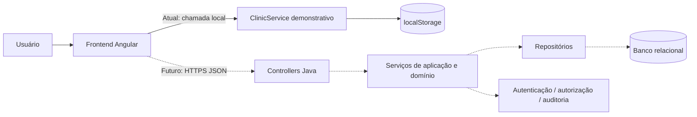
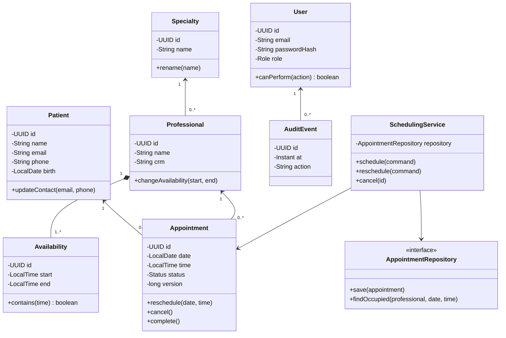
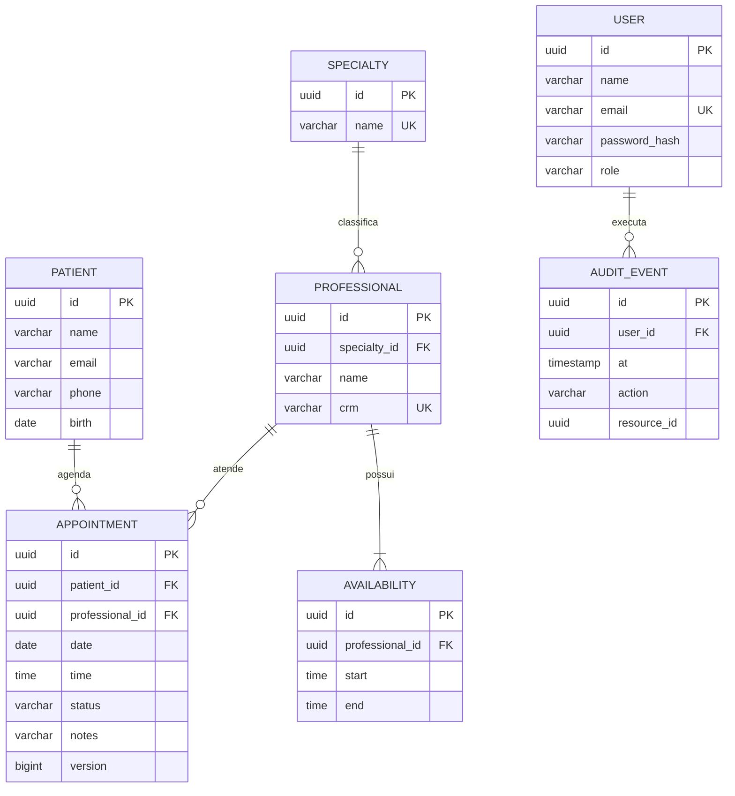

# Arquitetura e modelagem propostas

Diagramas conceituais para o desenvolvimento futuro do servidor. O único fluxo implementado agora é Angular → ClinicService → localStorage.

Pacotes sugeridos: `controller`, `dto`, `service`, `domain`, `repository`, `security`, `exception`. Controllers traduzem HTTP; DTOs delimitam dados; serviços coordenam transações; entidades encapsulam estados; repositórios persistem; tratamento global de exceções converte erros sem expor detalhes internos. Escolher o banco e configurar migrações na etapa de backend.

## Classes UML conceituais

Encapsulamento: transições por métodos, não setters livres de status. Composição: disponibilidade pertence ao profissional. Interface de repositório separa persistência e domínio. Não há necessidade demonstrada de herança entre paciente e profissional; evitar hierarquia artificial. Essas decisões são propostas, não classes Java já implementadas.

## DER proposto

Definir restrição de exclusividade para profissional/data/hora enquanto status diferente de Cancelado. O mecanismo exato depende do banco: índice único condicional ou tabela de slots com reserva transacional. Não confiar somente em verificar e depois inserir, pois existe condição de corrida. Remarcação deve liberar/reservar de forma atômica e comparar versão. Exclusões físicas de pessoas com consultas não estão no escopo; planejar inativação.

## Três fluxos ponta a ponta planejados

1. **Criar consulta:** formulário solicita disponibilidade → GET availability → usuário escolhe → POST appointments → autenticar/autorizar → validar IDs, data, expediente e exclusividade → persistir consulta/auditoria na mesma transação → 201 → atualizar agenda e indicadores. Se outra requisição ganhar a vaga: 409, sem gravação parcial.
2. **Remarcar:** abrir consulta existente → editar e PATCH com versão → servidor valida estado e versão → confere nova vaga → atualiza reserva e auditoria em transação → 200 → frontend atualiza lista. Conflito: manter reserva antiga e responder 409.
3. **Cancelar:** usuário confirma → POST cancel → servidor valida permissão/estado → marca Cancelado e registra auditoria → commit → 200 → frontend libera visualmente o horário. Falha de banco: rollback e erro público, sem mostrar confirmação de sucesso.

Na demonstração atual essas etapas usam apenas o serviço local e o armazenamento do navegador. Não há tráfego HTTP ou transação real.
