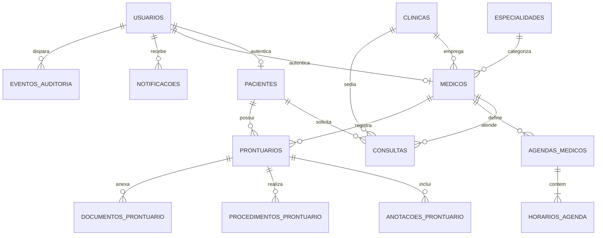

# Arquitetura do Banco de Dados — MedFlow (PostgreSQL)

O banco de dados do **MedFlow** é modelado 100% em **Português**, com chaves primárias do tipo **`BIGINT`** sequenciais (1, 2, 3...) utilizando `GENERATED BY DEFAULT AS IDENTITY`, garantindo alto desempenho, índices compactos e compatibilidade direta com Spring Data JPA (`GenerationType.IDENTITY`).

---

## 🗂️ Modelo Entidade-Relacionamento (Tabelas)



---

## 📋 Detalhamento das Tabelas (IDs BIGINT)

### 1. `clinicas` (Empresas / Clínicas)
- Armazena as clínicas cadastradas na plataforma.
- **Campos**: `id (BIGINT PK)`, `nome`, `razao_social`, `cnpj`, `telefone`, `email`, `endereco`, `latitude`, `longitude`, `foto_logo_url`, `ativo`, `criado_em`, `atualizado_em`.

### 2. `especialidades` (Especialidades Médicas)
- Armazena as especialidades (Dermatologia, Nutrição, Cardiologia, etc.).
- **Campos**: `id (BIGINT PK)`, `nome`, `descricao`, `icone`, `cor`, `ativo`, `criado_em`, `atualizado_em`.

### 3. `usuarios` (Contas e Autenticação)
- Gerencia o login único e perfis (`perfil`: `paciente`, `medico`, `clinica`, `admin`).
- **Campos**: `id (BIGINT PK)`, `email`, `senha_hash`, `perfil`, `foto_url`, `ativo`, `ultimo_login_em`, timestamps.

### 4. `pacientes` (Pacientes)
- Dados cadastrais do paciente vinculado ao usuário.
- **Campos**: `id (BIGINT PK)`, `usuario_id (BIGINT FK)`, `nome`, `cpf`, `data_nascimento`, `telefone`, `email`, `foto_url`, `contato_emergencia`, `ativo`, timestamps.

### 5. `medicos` (Médicos e Especialistas)
- Perfil do médico com especialidade, CRM, consultório e coordenadas de GPS.
- **Campos**: `id (BIGINT PK)`, `usuario_id (BIGINT FK)`, `clinica_id (BIGINT FK)`, `especialidade_id (BIGINT FK)`, `nome`, `primeiro_nome`, `crm`, `email`, `telefone`, `biografia`, `avaliacao`, `foto_url`, `nome_consultorio`, `endereco`, `latitude`, `longitude`, `horario_inicio`, `horario_fim`, `duracao_consulta_minutos`, `ativo`, timestamps.

### 6. `agendas_medicos` & `horarios_agenda` (Agenda e Horários do Médico)
- Controle de dias e horários liberados para agendamento.
- **agendas_medicos**: `id (BIGINT PK)`, `medico_id (BIGINT FK)`, `data_agenda (DATE)`. (Índice único `medico_id + data_agenda`).
- **horarios_agenda**: `id (BIGINT PK)`, `agenda_id (BIGINT FK)`, `horario (VARCHAR ex: '08:00')`, `disponivel (BOOLEAN)`.

### 7. `consultas` (Agendamentos)
- Agendamentos entre paciente e médico.
- **Campos**: `id (BIGINT PK)`, `paciente_id (BIGINT FK)`, `medico_id (BIGINT FK)`, `clinica_id (BIGINT FK)`, `data_consulta`, `horario_consulta`, `status` (`Pendente`, `Confirmado`, `Compareceu`, `Nao compareceu`, `Em atendimento`, `Concluído`, `Cancelado`), `tipo`, `motivo`, `motivo_cancelamento`, `cancelado_em`, `versao`, timestamps.
- **Índice Único Condicional**:
  ```sql
  CREATE UNIQUE INDEX idx_unico_medico_consulta_ativa
  ON consultas (medico_id, data_consulta, horario_consulta)
  WHERE status != 'Cancelado';
  ```
  *Garante que nunca ocorra agendamento duplo concorrente para o mesmo médico e horário.*

### 8. `prontuarios`, `anotacoes_prontuario`, `procedimentos_prontuario`, `documentos_prontuario`
- Histórico clínico de atendimentos, anotações de evolução, procedimentos e upload de documentos/receitas (todos com IDs e chaves estrangeiras `BIGINT`).

### 9. `notificacoes`
- Avisos e lembretes para usuários, médicos e pacientes (`id BIGINT PK`).

### 10. `eventos_auditoria` (Trilha de Auditoria)
- Rastreamento seguro de ações executadas no sistema (`id BIGINT PK`).

---

## 🚀 Como Executar o Banco de Dados

### Opção 1: Usando Docker Compose (Recomendado)
Na raiz do projeto MedFlow, execute:
```bash
docker compose up -d
```
O PostgreSQL 16 será iniciado na porta `5432` com o banco `medflow_db` e o script inicial com IDs `BIGINT` sequenciais executado automaticamente.

### Opção 2: Executar no PostgreSQL local / DBeaver / pgAdmin
Basta abrir o arquivo [medflow_complete_database.sql](file:///c:/Users/SAULO358/Documents/github/MedFlow/docs/database/medflow_complete_database.sql) e executá-lo no seu cliente SQL preferido.

### Opção 3: Inicialização Automática via Spring Boot + Flyway
Ao iniciar a aplicação Spring Boot (`./mvnw spring-boot:run` na pasta `backend`), o **Flyway** detecta e aplica as migrações automaticamente:
- `V1__create_medflow_database_schema.sql`
- `V2__seed_initial_data.sql`
