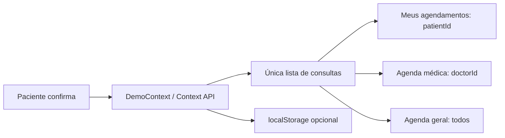

# Frontend React — guia técnico

## Stack e execução

React 19, React Router, Context API, JavaScript/JSX, CSS, Lucide e Vite. Testes com Vitest, Testing Library e Playwright. Não há TypeScript no código da aplicação. Bibliotecas podem incluir declarações de tipos como dependências internas.

```powershell
cd frontend/medflow-frontend
npm ci
npm start
npm run build
npm test
npm run test:e2e
```

Vite em http://localhost:4200. Build estático em `dist/`; configurar fallback de SPA para `index.html` ao hospedar, permitindo acesso direto às rotas. Nenhum servidor de aplicação ou API é necessário.

## Rotas

| Perfil | Rotas |
|---|---|
| Paciente | `/paciente`, `/paciente/agendar`, `/paciente/agendamentos`, `/paciente/historico`, `/paciente/notificacoes`, `/paciente/perfil` |
| Especialista | `/medico`, `/medico/agenda`, `/medico/agendar`, `/medico/pacientes`, `/medico/prontuarios`, `/medico/prontuarios/:id`, `/medico/atendimentos`, `/medico/notificacoes`, `/medico/perfil` |
| Clínica | `/clinica`, `/clinica/agenda`, `/clinica/agendamentos`, `/clinica/agendar`, `/clinica/pacientes`, `/clinica/profissionais`, `/clinica/prontuarios`, `/clinica/prontuarios/:id`, `/clinica/especialidades`, `/clinica/relatorios`, `/clinica/configuracoes` |

`/` é a tela de login e `/cadastro` permite somente cadastro de paciente. `RequireAccount` redireciona visitantes ao login e contas de outro perfil à própria área. A identidade do paciente ou médico vem da conta atual. Não há seletor livre de área. A clínica cria contas médicas em Profissionais. Consulte [Acesso e cadastro](ACESSO.md).

## Organização e componentes

`App.jsx` define rotas e lazy loading; `AreaLayout` compõe Sidebar, TopHeader e MobileBottomNavigation específicos de cada perfil. `DemoContext` concentra leitura/gravação e ações. `mockData.js` cria as fixtures. `utils/appointments.js` contém operações puras e validações; `utils/date.js` trata datas locais.

Componentes reutilizados: AppointmentCard, AppointmentDetailsModal, DoctorCard, SpecialtyCard, ScheduleCalendar, TimeSlotPicker, DatePicker, MedicalRecordCard, StatusBadge, DashboardCard, SearchInput, EmptyState, LoadingSkeleton, ConfirmationModal, Modal, Avatar e PatientForm. Páginas compartilhadas recebem `area` e aplicam o recorte correspondente, evitando três cópias das mesmas regras.

## Estado e sincronização



Operações de criação/remarcação validam o estado mais recente por referência síncrona antes de publicar o próximo estado React. Salvar consulta também atualiza o cadastro demonstrativo e cria notificação. Cancelar libera o slot; iniciar cria prontuário para novo vínculo paciente/profissional; concluir muda o status. As contagens dos dashboards são calculadas, não números decorativos.

O frontend não popula perfis demonstrativos. A sessão usa `sessionStorage`; autenticação, perfis e persistência dependem do backend. Armazenamento bloqueado produz aviso; não há sincronização entre dispositivos ou tratamento de concorrência entre abas.

## Agenda e formulários

Slots de 30 minutos entre 08:00 e 18:00, intervalo 12:00–13:00, expediente diário fictício. Datas passadas, horários já transcorridos de hoje, slots ocupados e fora do expediente são bloqueados. O mesmo paciente também não pode ter consultas simultâneas. Os campos são nome, nascimento, telefone, e-mail e CPF fictício com 11 dígitos (sem validação fiscal de dígitos verificadores). Observação opcional de até 500 caracteres.

Paciente: especialidade → profissional → data/horário → dados → revisão. Clínica: seleciona ou preenche paciente antes dessas etapas. Reagendamento mantém o ID. Os horários indisponíveis continuam visíveis, mas desabilitados.

## Limites intencionais

Login e permissões são simulações locais de frontend, sem autenticação de produção. Não há prontuário real, API, banco, upload, mensagens externas, pagamento ou diagnóstico. Relatórios exportam apenas totais locais em CSV. Retratos são ilustrações SVG próprias, não fotografias de profissionais reais. Autorização no servidor, fuso da clínica e persistência compartilhada ficam para futura integração fora desta entrega.
