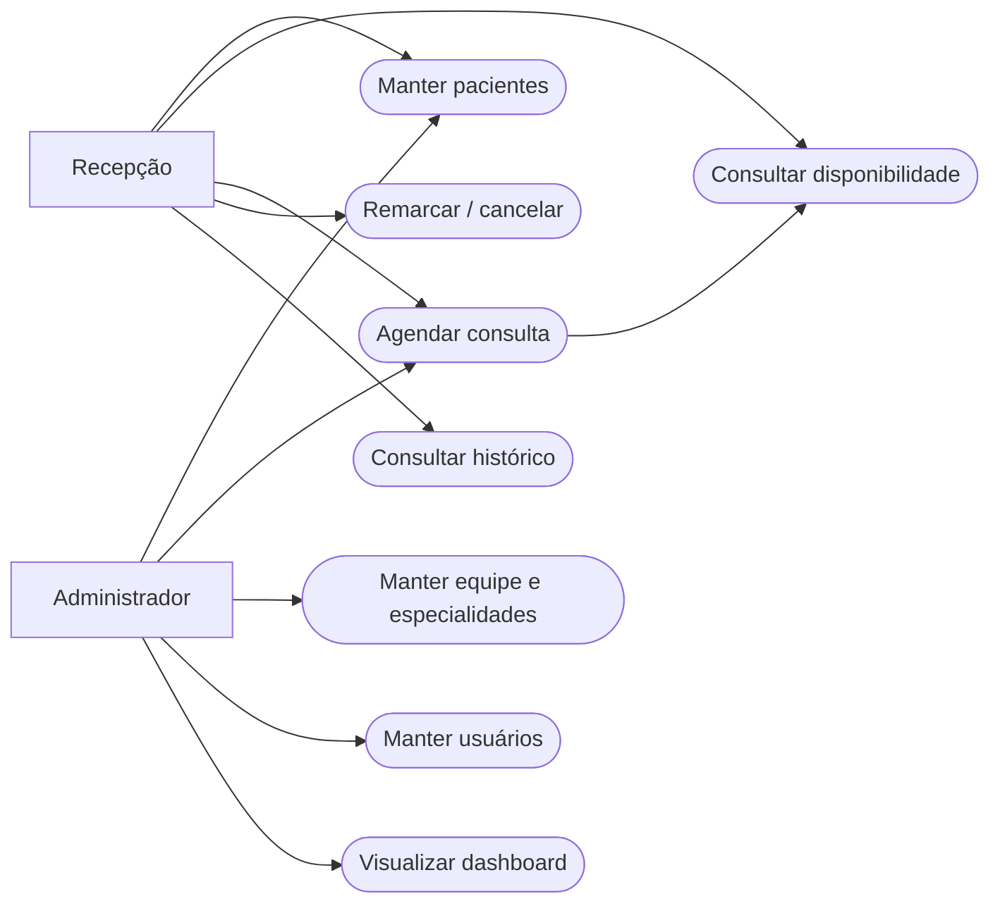

# Requisitos e casos de uso

Requisitos derivados do PDF e delimitados à entrega frontend. Alta prioridade significa necessária à demonstração; todas as garantias de segurança e integridade do produto final pertencem ao servidor.

| ID | Requisito funcional | Prioridade | Critério de aceite local |
|---|---|---|---|
| RF01 | Acesso demonstrativo | Alta | Credencial de teste entra; credencial diferente mostra erro |
| RF02 | Gerenciar pacientes | Alta | Cadastrar/editar nome, e-mail, telefone e nascimento; buscar por nome |
| RF03 | Gerenciar profissionais | Alta | Cadastrar/editar CRM único, especialidade e expediente |
| RF04 | Gerenciar especialidades | Alta | Cadastrar/editar e rejeitar nome repetido |
| RF05 | Consultar disponibilidade | Alta | Mostrar slots de 30 minutos livres no expediente |
| RF06 | Agendar consulta | Alta | Vincular paciente/profissional existentes, data e horário livres |
| RF07 | Remarcar consulta | Alta | Manter ID e liberar horário antigo ao salvar nova data/hora |
| RF08 | Cancelar consulta | Alta | Pedir confirmação, registrar status e liberar vaga |
| RF09 | Consultar histórico | Alta | Registrar operações e permitir busca textual |
| RF10 | Dashboard | Alta | Exibir totais derivados dos dados do dia e pacientes cadastrados |
| RF11 | Gerenciar usuários | Alta | Editar perfis demonstrativos; não criar acesso real |
| RF12 | Concluir atendimento | Média | Atualizar status e indicadores, preservando consulta |

## Não funcionais

- RNF01: layout adaptável com pontos de ajuste em 1250, 950 e 680 px; tabelas podem rolar horizontalmente.
- RNF02: formulários com rótulos, foco visível, diálogo nativo, fechamento por Escape e link para pular navegação.
- RNF03: estado reativo e listagens sem dependência de rede na demonstração; build dentro do orçamento configurado de 500 kB de aviso inicial.
- RNF04: mensagens de erro e sucesso; estado vazio; falha de armazenamento comunicada.
- RNF05: dados fictícios, nenhuma senha de usuário persistida; autenticação e autorização reais pendentes.
- RNF06: testes automatizados das regras críticas de agendamento e renderização inicial.

## Regras de negócio

| ID | Regra | Implementação nesta entrega |
|---|---|---|
| RN01 | Um profissional por horário ativo | Validação local em `appointmentError`; servidor deverá repetir em transação |
| RN02 | Agenda respeita disponibilidade | Expediente diário, início inclusivo e fim exclusivo, slots de 30 min |
| RN03 | Paciente e profissional válidos | IDs conferidos antes de salvar |
| RN04 | Cancelar/remarcar atualiza vagas | Disponibilidade calculada pelas consultas atuais |
| RN05 | Datas novas não anteriores a hoje | Campo HTML e validação local |
| RN06 | Mudança de expediente preserva consultas confirmadas futuras | Bloqueio quando excluir um horário reservado |
| RN07 | CRM, nome de especialidade e e-mail de usuário únicos | Comparação local sem diferenciar maiúsculas/minúsculas |

## Atores e visão de casos de uso

Atores conceituais: Recepção e Administrador. Nesta versão ambos são representados por uma única sessão demonstrativa administrativa, sem autorização real por perfil.

O diagrama acima é uma representação de atores e casos com Mermaid, não uma notação UML estrita.

### UC01 — Agendar

Ator: Recepção. Objetivo: reservar horário. Pré-condições: sessão demonstrativa aberta, paciente e profissional cadastrados. Fluxo: abrir novo agendamento; selecionar paciente; selecionar profissional; escolher data; selecionar horário livre; confirmar; validar; salvar no navegador; mostrar sucesso e atualizar agenda/histórico. Alternativa: voltar sem salvar. Exceções: campo vazio, data passada ou conflito produzem erro sem alteração. Se armazenamento falhar, mostrar aviso de persistência limitada à sessão. Pós-condição: consulta confirmada no estado local.

### UC02 — Remarcar

Ator: Recepção. Pré-condição: consulta confirmada. Fluxo: acionar seta da consulta; mudar data/profissional/horário; confirmar; validar ignorando o próprio ID; substituir registro; atualizar histórico. Alternativa: fechar mantém original. Exceção: conflito não altera consulta original. Pós-condição: novo horário ocupado e anterior livre.

### UC03 — Cancelar

Ator: Recepção. Pré-condição: consulta confirmada. Fluxo: acionar cancelar; revisar confirmação; confirmar cancelamento; registrar status/histórico; recalcular vagas e indicadores. Alternativa: manter consulta. Pós-condição: consulta preservada com status Cancelado e horário liberado.

### UC04 — Cadastrar paciente

Ator: Recepção. Pré-condição: sessão aberta. Fluxo: preencher nome, e-mail, telefone com DDD e nascimento; salvar; validar; atualizar lista. Alternativa: voltar. Exceções: nome curto, contato inválido ou nascimento futuro impedem a operação. Pós-condição: paciente disponível no formulário de agenda.
