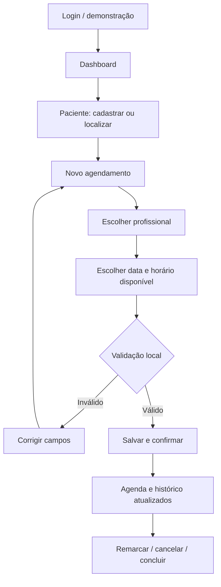

# Identidade visual e UX/UI

## Marca

Nome: **MedFlow**. Slogan: **Gestão que cuida.** Símbolo: cruz branca em quadrado verde arredondado, em `frontend/medflow-frontend/public/logo.svg`. A cruz comunica cuidado; o nome associa saúde ao fluxo administrativo. O arquivo é vetorial e pode ser reutilizado na apresentação. Não há imagem gerada por IA ou dependência de banco de imagens.

| Token | Valor | Uso |
|---|---|---|
| Verde principal | `#087f70` | Ações, marca e navegação ativa |
| Texto principal | `#253c39` | Títulos e conteúdo |
| Texto secundário | `#778781` | Apoio e descrições |
| Fundo | `#f5f8f7` | Área de trabalho |
| Borda | `#e5ece9` | Separação de conteúdo |
| Branco | `#ffffff` | Superfícies e formulários |

Tipografia: Segoe UI, Arial e sans-serif, sem downloads. Títulos entre 18 e 30 px no aplicativo, hierarquia mais expressiva no login. Espaçamento baseado em intervalos próximos de 4/8 px; cartões com 10–12 px de raio; botões com 7 px. Verde suave e superfícies claras reduzem competição visual com os dados. Cores não são o único indicador: status e mensagens também usam texto.

## Componentes e estados

Navegação lateral com item ativo, cabeçalho de contexto, cards de métricas, tabelas, cartões de profissionais, campos com rótulo, selects de disponibilidade, diálogo nativo e mensagens com `role=status`/`role=alert`. Busca sem resultado exibe estado vazio. Foco dos controles é destacado. O modal nativo contém o foco enquanto aberto e o devolve ao acionador ao fechar. Navegação por teclado e contraste precisam de auditoria manual antes de publicação.

## User flow



## Wireframe desktop

```text
┌─────────────┬────────────────────────────────────────────┐
│ Marca       │ Workspace / Tela                    Demo   │
│ Clínica     ├────────────────────────────────────────────┤
│             │ Título / descrição       [Nova consulta]   │
│ Dashboard   │ Banner de boas-vindas                       │
│ Agenda      │ [Total] [Confirmadas] [Concluídas] [Pessoas]│
│ Pacientes   │ ┌ Agenda por data ──────────┐ ┌ Atalhos ┐ │
│ Equipe      │ │ Busca / filtros / tabela │ │         │ │
│ Histórico   │ └──────────────────────────┘ └─────────┘ │
│ Perfil      │ Rodapé                                     │
└─────────────┴────────────────────────────────────────────┘
```

## Wireframe mobile

```text
┌─────────────────────────┐
│ Marca                   │
│ Menu horizontal rolável │
│ Título / descrição      │
│ [Novo agendamento]      │
│ Banner                  │
│ [Métrica] [Métrica]     │
│ [Métrica] [Métrica]     │
│ Agenda / data           │
│ Busca / filtros         │
│ Tabela com rolagem      │
│ Atalhos                 │
└─────────────────────────┘
```

## Protótipo de alta fidelidade

A aplicação Angular executável é o protótipo navegável. Login, dashboard, agenda, cadastros e modais representam a identidade final proposta. Não foi criado arquivo Figma. Breakpoints fazem a barra lateral virar navegação horizontal, métricas passarem a duas colunas e formulários a uma coluna. Não há capturas verificadas nesta entrega: a ferramenta de navegador falhou antes de abrir a aplicação. Use o roteiro em TESTES.md para validar desktop e mobile e acrescentar evidências.
