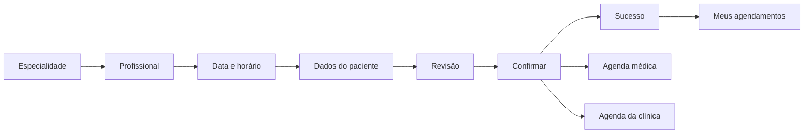

# UX/UI — Cuidado que conecta

## Identidade

MedFlow utiliza off-white, branco, verde sálvia, rosé, bege e azul suaves. O símbolo de coração e os cantos arredondados reforçam o acolhimento. Títulos editoriais em Georgia na entrada/paciente contrastam com a tipografia de sistema legível da operação. Ícones Lucide e retratos SVG locais não exigem serviços de imagens.

Tokens principais em `src/styles/global.css`: fundo `#f8f9f6`, texto `#35453f`, ação `#54867b`, borda `#e8ece5`. Status combinam texto e cor: verde Confirmado, amarelo Pendente, azul Em atendimento, cinza Concluído, vermelho suave Cancelado.

## Três experiências

**Paciente:** saudação pessoal, banner acolhedor, próximo agendamento e atalhos por especialidade. O fluxo evita informação administrativa e permite apenas suas próprias consultas.

**Especialista:** indicadores do profissional conectado, agenda em três períodos, relação de pacientes, prontuários e ações de atendimento. Cada acesso está vinculado a um profissional cadastrado pela clínica.

**Clínica:** visão da operação, agenda geral e filtros, tabela/card de pacientes, equipe, prontuários, relatórios e configurações compartilhadas.

## Mobile

Abaixo de 768 px: navegação inferior, menu completo recolhível, formulários de uma coluna, tabelas transformadas em cards com rótulos e agendas semanais empilhadas. A visão mensal mantém os sete dias, mostra o horário e abre detalhes pelo toque. O calendário completo usa o controle de data nativo do dispositivo. Áreas essenciais de toque ficam em torno de 44 px.

## Fluxo

## Estados e acessibilidade

Skeletons acompanham o carregamento real das rotas lazy; a confirmação exibe estado de processamento breve. Toasts comunicam operações. Modais nativos permitem Escape, foco contido e restauração do acionador. Formulários possuem labels e mensagens; horários bloqueados usam disabled. Os estados vazios orientam o próximo passo. Animações respeitam `prefers-reduced-motion`.

## Evidências

As capturas geradas pelo teste de navegador ficam em `screenshots/`: paciente desktop/mobile, agenda médica e dashboard da clínica. Os retratos representam personagens fictícios e não fotografias. O protótipo de alta fidelidade é a aplicação navegável; não há arquivo Figma.
